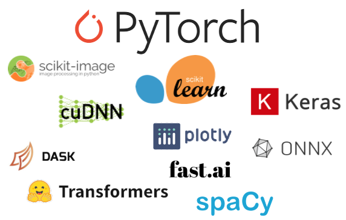

# Deep Learning Libraries Installers for ArcGIS

  

ArcGIS Pro, Server and the ArcGIS API for Python all include tools to use AI and Deep Learning to solve geospatial problems, such as feature extraction, pixel classification, and feature categorization.  This installer includes a broad collection of components, such as PyTorch, TensorFlow, Fast.ai and scikit-learn, for performing deep learning and machine learning tasks, a total collection of 99 packages. These packages can be used with the [Deep Learning Training tools](https://pro.arcgis.com/en/pro-app/latest/help/analysis/image-analyst/deep-learning-in-arcgis-pro.htm), [interactive object detection](https://pro.arcgis.com/en/pro-app/latest/help/mapping/exploratory-analysis/interactive-object-detection-basics.htm), by using the [`arcgis.learn`](https://developers.arcgis.com/python/guide/geospatial-deep-learning/) module within the ArcGIS API for Python, and directly imported into your own scripts and tools. Most of the tools in this collection will work on any machine, but common deep learning workflows require a recent NVIDIA graphics processing unit (GPU), and problem sizes are bound by available GPU memory, see [the requirements section](#requirements).

This installer adds all the included packages to the default [`arcgispro-py3` environment](https://pro.arcgis.com/en/pro-app/latest/arcpy/get-started/installing-python-for-arcgis-pro.htm) that Pro and Server both ship with, and no additional environments are necessary in order to get started using the tools. If you do create custom environments, these packages will also be included so you can use the same tools in your own custom environments as well.

For an example of the kinds of workflows this installer and ArcGIS enables, see the [AI & Deep Learning in the UC 2020 Plenary video](https://www.youtube.com/watch?v=eI5Sv_FsPgk&feature=youtu.be&list=PLaPDDLTCmy4YwK56yHaEdtRgNUoPBiZTz)

Download
--------

  - **[Deep Learning Libraries Installer for ArcGIS Pro 3.1](https://links.esri.com/pro-deep-learning-libraries/31)**
  - **[Deep Learning Libraries Installer for ArcGIS Pro 3.0.3](https://links.esri.com/pro-deep-learning-libraries/303)**
  - **[Deep Learning Libraries Installer for ArcGIS Pro 3.0&mdash;3.0.2](https://links.esri.com/pro-deep-learning-libraries/30)**
  - **[Deep Learning Libraries Installer for ArcGIS Server 11.0](https://links.esri.com/server-win-deep-learning-libraries/11)**
  - **[Deep Learning Libraries Installer for ArcGIS Server Linux 11.0](https://links.esri.com/server-linux-deep-learning-libraries/11)**

  
<b>Downloads for Previous Releases</b>

  - **[Deep Learning Libraries Installer for ArcGIS Pro 2.9](https://links.esri.com/pro-deep-learning-libraries/29)**
  - **[Deep Learning Libraries Installer for ArcGIS Pro 2.8](https://github.com/Esri/deep-learning-frameworks/releases/download/pro-2.8/ArcGIS_Pro_28_Deep_Learning_Libraries.zip)**
  - **[Deep Learning Libraries Installer for ArcGIS Pro 2.7](https://github.com/Esri/deep-learning-frameworks/releases/download/pro-2.7/ArcGIS_Pro_27_Deep_Learning_Libraries.zip)**
  - **[Deep Learning Libraries Installer for ArcGIS Pro 2.6](https://github.com/Esri/deep-learning-frameworks/releases/download/pro-2.6/ArcGIS_Pro_26_Deep_Learning_Libraries.zip)**
  - **[Deep Learning Libraries Installer for ArcGIS Server 10.9.1](https://links.esri.com/server-win-deep-learning-libraries/1091)**
  - **[Deep Learning Libraries Installer for ArcGIS Server 10.9](https://github.com/Esri/deep-learning-frameworks/releases/download/server-10.9/ArcGIS_Server_109_Deep_Learning_Libraries.zip)**
  - **[Deep Learning Libraries Installer for ArcGIS Server 10.8.1](https://github.com/Esri/deep-learning-frameworks/releases/download/server-10.8.1/ArcGIS_Server_1081_Deep_Learning_Libraries.zip)**
  - **[Deep Learning Libraries Installer for ArcGIS Server Linux 10.9.1](https://links.esri.com/server-linux-deep-learning-libraries/1091)**
  - **[Deep Learning Libraries Installer for ArcGIS Server Linux 10.9](https://github.com/Esri/deep-learning-frameworks/releases/download/linux-server-10.9/ArcGIS_Linux_Server_109_Deep_Learning_Libraries.tar.gz)**
  - **[Deep Learning Libraries Installer for ArcGIS Server Linux 10.8.1](https://github.com/Esri/deep-learning-frameworks/releases/download/linux-server-10.8.1/ArcGIS_Linux_Server_1081_Deep_Learning_Libraries.tar.gz)**

Installation
------------

**On Windows:**

Once you've downloaded the archive for your product, extract the Zip file to a new location, and run the Windows Installer (e.g. `ProDeepLearning.msi`) on Windows. This will install the deep learning frameworks into the default `arcgispro-py3` Python environment, but not any custom environments you've created prior to running this installation. After installation, subsequent clones will also include the full deep learning package set. You'll need to extract the file (not just open the .MSI from within the Zip file) or the installer won't be able to find its contents.  After installation, the archive and installer files can be deleted.

**On Server Linux:**

Extract the .tar.gz archive, e.g. with `tar xvf <file>.tar.gz`, then run the `DeepLearning-Setup.sh` script. For Server 10.9 and earlier, this would create a package set inside of the Server runtime environment. Starting at Server 10.9.1, this installation creates a new `deeplearning` environment located in `<Server Install>/framework/runtime/deeplearning` and the deep learning packages are all native Linux implementations. Next, please uncomment and update the `ARCGIS_CONDA_DEEPLEARNING` variable in the `<Server Install>/arcgis/server/usr/init_user_param.sh` file and restart your ArcGIS Server.

**Upgrading From a Previous Version:**

If you're upgrading from a previous release, the safest way to upgrade is to uninstall and reinstall both the product and the deep learning installer. For example, to upgrade from Pro 2.8 to Pro 2.9:

1. Uninstall Deep Learning Libraries for ArcGIS Pro 2.8
2. Uninstall ArcGIS Pro 2.8
3. Directly remove any files still present in `C:\Program Files\ArcGIS\Pro\bin\Python\envs\arcgispro-py3` or equivalent location for your installation. These may have been left over from previously modified environment.
5. Install ArcGIS Pro 2.9
6. Install ArcGIS Pro 2.9 Deep Learning downloaded from this site.

After these steps, you should have a clean Pro installation with the Deep Learning package set included in the default `arcgispro-py3` environment.

**Manual Installation:**

  
You can install the libraries manually using these archived instructions:

  - **[Pro 2.8 Manual Installation Instructions](include/install-deep-learning-frameworks-manually-2-8.pdf)**
  - **[Pro 2.7 Manual Installation Instructions](include/install-deep-learning-frameworks-manually-2-7.pdf)**
  - **[Pro 2.6 Manual Installation Instructions](include/install-deep-learning-frameworks-manually-2-6.pdf)**

Developer install steps
--------

:warning: | Following these steps will install an experimental unverified package set
:---:|:---
:information_source: | Make sure to clone the default Python environment to backup your install (see below)

  
You can install the deep learning libraries from a command prompt using these steps:

1. Open the `Python Command Prompt` window.
    - You can search for this command prompt in the `Start` menu on Windows, or you can launch it from the product's install folder.
    - If running an enterprise product search for the `Python Command Prompt 3`
2. Clone the default Python environment with this command: (don't forget the `--pinned`!)
    > `conda create -n your-clone-name --clone arcgispro-py3 --pinned
3. When the Python environment has been cloned, activate the cloned environment:
    > `activate your-clone-name`
    - When the cloned enviornment is activated, the new environment name appears at the beginning of the path:
    > `(your-clone-name) C:\Program Files\ArcGIS\Pro\bin\Python\envs>`
4. Install the deep learning essentials libraries into your cloned environment with:
    > `conda install deep-learning-essentials`
    - When prompted to proceed, review the information, type `y`, and press `Enter`
    - If the packages install successfully your cloned enviornment is now setup to run deep learning workflows
5. Type the following command to swap your product's default enviornment to your new cloned environment:
    > `proswap your-clone-name`
    - When you next launch your product it will launch with `your-clone-name` as the active Python Environment and you should now be able to use deep learning tools
6. If you run into any issues please contact [Esri Technical Support](https://support.esri.com/en/contact-tech-support)

Additional Installation for Disconnected Environment
--------

If you will be working in a disconnected environment, download the `arcgis_dl_backbones` package from the links below and follow the instructions under the **Steps to Install** listed on the package page. The package places backbones for deep learning models in the specified install location, eliminating the need for internet access when training deep learning models in ArcGIS.

Pro versions | Server versions | Backbones package
-|-|-
2.9&mdash;3.0 | 10.9.1&mdash;11.0 | [PyTorch 1.8 `arcgis_dl_backbones` package](https://geosaurus.maps.arcgis.com/home/item.html?id=ad8ecd2a45af4e3282a4d9ff455024be)
2.5&mdash;2.8 | 10.7.1&mdash;10.9.0 | [PyTorch 1.4 `arcgis_dl_backbones` package](https://geosaurus.maps.arcgis.com/home/item.html?id=d404fd50d05d475f8d92eedb78e1c961)

Next Steps
----------

Once you've installed the deep learning libraries, you can use the [Deep Learning Tools](https://pro.arcgis.com/en/pro-app/help/analysis/image-analyst/deep-learning-in-arcgis-pro.htm) to train geospatial deep learning models. You can also find out more about the capabilities of the [arcgis.learn module](https://developers.arcgis.com/python/guide/geospatial-deep-learning/) which provides specialized access to many geospatial models beyond those directly available as Geoprocessing tools. Finally, you can add any of the above libraries to your own workflows, by importing the packages listed below.

 - Learn ArcGIS lesson on using [Deep Learning to Access Palm Tree Health](https://learn.arcgis.com/en/projects/use-deep-learning-to-assess-palm-tree-health/)
 - Join us later in 2021 for the [Spatial Data Science MOOC](https://www.esri.com/training/catalog/5d76dcf7e9ccda09bef61294/spatial-data-science:-the-new-frontier-in-analytics/#!)

A collection of recent User Conference 2020 Technical Workshops on Deep Learning:

 - [Deep Dive into Deep Learning](https://uc2020.esri.com/live-stream/15346124/Deep-Dive-into-Deep-Learning)
 - [Deep Learning for Geographers](https://uc2020.esri.com/sessions/15346174/Deep-Learning-for-Geographers)
 - [Using Deep Learning with Imagery in ArcGIS](https://uc2020.esri.com/live-stream/15345718/Using-Deep-Learning-with-Imagery-in-ArcGIS)

Requirements
------------

Most of the packages included in the Deep Learning Libraries installer will work out of the box on any machine configuration. For example, PyTorch optionally can take advantage of a GPU, but will fall back to running its calculations on the CPU if a GPU is not available. However, GPU computation is significantly faster, and some packages such as TensorFlow in this distribution only will work with a supported GPU.  CUDA, or Compute Unified Device Architecture, is a general purpose computing platform for GPUs, a requirement for current GPU backed deep learning tools.

 GPU requirement | Supported
 -----|---------------------
 GPU Type | NVIDIA with CUDA Compute Capability 3.7 minimum, 6.1 or later recommended. See the list of [CUDA-enabled cards](https://developer.nvidia.com/cuda-gpus) to determine the compute capability of a GPU.
GPU driver | [NVIDIA GPU drivers](https://www.nvidia.com/drivers) &mdash; version 456.38 or higher is required.
 Dedicated graphics memory &dagger; | minimum: 4GB  recommended: 8GB or more, depending on the deep learning model architecture and the batch size being used

&dagger; GPU memory, unlike system memory, cannot be accessed 'virtually'. If a model training consumes more GPU memory than you have available, it will fail. GPU memory is also shared across all uses of the machine, so open Pro projects with maps and other applications can limit the available memory for use with these tools.

:information_source: An out-of-date GPU driver will cause deep learning tools to fail with runtime errors indicating that CUDA is not installed or an unsupported toolchain is present. Verify that you have up-to-date GPU drivers directly provided by NVIDIA.

### Tool Requirements

Geoprocessing tools using deep learning are integrated into multiple areas of the software, and require the related extensions installed to function:

Tools | Extension
-|-
[Model training, inferencing and exploration](https://pro.arcgis.com/en/pro-app/latest/help/analysis/deep-learning/deep-learning-in-arcgis-pro.htm) | [Image Analyst](https://pro.arcgis.com/en/pro-app/latest/help/analysis/image-analyst/what-is-the-arcgis-pro-image-analyst-extension-.htm)
[Point cloud classification](https://pro.arcgis.com/en/pro-app/latest/tool-reference/3d-analyst/an-overview-of-the-point-cloud-toolset.htm) | [3D Analyst](https://pro.arcgis.com/en/pro-app/latest/tool-reference/3d-analyst/an-overview-of-the-3d-analyst-toolbox.htm)
[AutoML and text analysis](https://pro.arcgis.com/en/pro-app/latest/tool-reference/geoai/an-overview-of-the-geoai-toolbox.htm) | [Advanced, no extension required](https://pro.arcgis.com/en/pro-app/latest/tool-reference/geoai/geoai-toolbox-license.htm)

Manifest of included packages
-----------------------------

Library Name | Version | Description
-------------|---------|------------
[abseil-cpp](https://abseil.io/) | 20210324.2 | Abseil C++ Common Libraries
[absl-py](https://abseil.io/) | 1.3.0 | Abseil Python Common Libraries
[addict](https://github.com/mewwts/addict) | 2.4.0 | Provides a dictionary whose items can be set using both attribute and item syntax
[aiohttp](https://github.com/aio-libs/aiohttp) | 3.8.3 | Async http client/server framework (asyncio)
[aiosignal](https://github.com/aio-libs/aiosignal) | 1.2.0 | A list of registered asynchronous callbacks
[alembic](https://bitbucket.org/zzzeek/alembic) | 1.6.4 | A database migration tool for SQLAlchemy
[astor](https://github.com/berkerpeksag/astor) | 0.8.1 | Read, rewrite, and write Python ASTs nicely
[astunparse](https://github.com/simonpercivall/astunparse) | 1.6.3 | An AST unparser for Python
[async-timeout](http://github.com/aio-libs/async_timeout) | 4.0.2 | Timeout context manager for asyncio programs
[blosc](https://github.com/Blosc/c-blosc) | 1.21.0 | A blocking, shuffling and loss-less compression library that can be faster than `memcpy()`
[boost](http://www.boost.org/) | 1.79.0 | Boost provides peer-reviewed portable C++ source libraries
[bzip2](http://www.bzip.org/) | 1.0.8 | High-quality data compressor
[cairo](http://cairographics.org/) | 1.14.12 | A 2D graphics library with support for multiple output devices
[catalogue](https://github.com/explosion/catalogue) | 1.0.0 | Super lightweight function registries for your library
[catboost](http://catboost.ai) | 0.26 | Gradient boosting on decision trees library
[category_encoders](https://github.com/scikit-learn-contrib/categorical_encoding) | 2.2.2 | A collection sklearn transformers to encode categorical variables as numeric
[cfitsio](https://heasarc.gsfc.nasa.gov/fitsio/fitsio.html) | 3.470 | A library for reading and writing FITS files
[charls](https://github.com/team-charls/charls) | 2.2.0 | CharLS, a C++ JPEG-LS library implementation
[cliff](https://github.com/openstack/cliff) | 3.8.0 | Command Line Interface Formulation Framework
[cmaes](https://github.com/CyberAgent/cmaes) | 0.8.2 | Blackbox optimization with the Covariance Matrix Adaptation Evolution Strategy
[cmd2](https://github.com/python-cmd2/cmd2) | 2.4.2 | A tool for building interactive command line apps
[colorlog](https://github.com/borntyping/python-colorlog) | 5.0.1 | Log formatting with colors!
[colour](https://github.com/vaab/colour) | 0.1.5 | Python color representations manipulation library (RGB, HSL, web, ...)
[cudatoolkit](https://developer.nvidia.com/cuda-toolkit) | 11.1.1 | NVIDIA's CUDA toolkit
[cudnn](https://developer.nvidia.com/cudnn) | 8.1.0.77 | NVIDIA's cuDNN deep neural network acceleration library
[cymem](https://github.com/explosion/cymem) | 2.0.6 | Manage calls to calloc/free through Cython
[cython](http://www.cython.org/) | 0.29.32 | The Cython compiler for writing C extensions for the Python language
[cython-blis](http://github.com/explosion/cython-blis) | 0.4.1 | Fast matrix-multiplication as a self-contained Python library – no system dependencies!
[dataclasses](https://github.com/ericvsmith/dataclasses://github.com/ericvsmith/dataclasses/) | 0.8 | A backport of the dataclasses module for Python 3.6
[deep-learning-essentials](https://github.com/esri/deep-learning-framworks) | 3.1 | Expansive collection of deep learning packages
[descartes](http://bitbucket.org/sgillies/descartes/) | 1.1.0 | Use geometric objects as matplotlib paths and patches
[dm-tree](https://tree.readthedocs.io) | 0.1.7 | A library for working with nested data structures
[dtreeviz](https://github.com/parrt/dtreeviz) | 1.3.7 | Decision tree visualization
[dtreeviz-extended](https://github.com/parrt/dtreeviz) | 1.3.7 | Decision tree visualization with included optional dependencies
einops | 0.3.2 | A new flavor of deep learning operations
[ensemble-boxes](https://github.com/ZFTurbo/Weighted-Boxes-Fusion) | 1.0.8 | Methods for ensembling boxes from object detection models
[fastai](https://github.com/fastai/fastai) | 1.0.63 | fastai makes deep learning with PyTorch faster, more accurate, and easier
[fastprogress](https://github.com/fastai/fastprogress) | 0.2.3 | A fast and simple progress bar for Jupyter Notebook and console
[fasttext](https://fasttext.cc/) | 0.9.2 | Efficient text classification and representation learning
[filelock](https://github.com/benediktschmitt/py-filelock) | 3.9.0 | A platform independent file lock
fire | 0.4.0 | A library for creating CLIs from absolutely any Python object
[flatbuffers](http://google.github.io/flatbuffers/) | 2.0.0 | Memory Efficient Serialization Library
[frozenlist](https://github.com/aio-libs/frozenlist) | 1.3.3 | A list-like structure which implements collections.abc.MutableSequence
gast | 0.4.0 | Python AST that abstracts the underlying Python version
[geos](http://trac.osgeo.org/geos/) | 3.5.0 | A C++ port of the Java Topology Suite (JTS)
[giflib](http://giflib.sourceforge.net) | 5.2.1 | Library for reading and writing gif images
[google-auth](https://github.com/googleapis/google-auth-library-python) | 2.6.0 | Google authentication library for Python
[google-auth-oauthlib](https://github.com/googleapis/google-auth-library-python-oauthlib) | 0.4.1 | Google Authentication Library, oauthlib integration with google-auth
[google-pasta](https://github.com/google/pasta) | 0.2.0 | pasta is an AST-based Python refactoring library
[googledrivedownloader](https://github.com/ndrplz/google-drive-downloader) | 0.4 | Minimal class to download shared files from Google Drive
[graphviz](http://www.graphviz.org/) | 2.38 | Open Source graph visualization software
[grpcio](https://grpc.io) | 1.42.0 | HTTP/2-based RPC framework
[h3-py](https://uber.github.io/h3-py/) | 3.7.3 | H3 Hexagonal Hierarchical Geospatial Indexing System
[html5lib](https://github.com/html5lib/html5lib-python) | 1.1 | HTML parser based on the WHATWG HTML specification
[icu](http://site.icu-project.org/) | 68.1 | International Components for Unicode
imagecodecs | 2021.8.26 | Image transformation, compression, and decompression codecs
[imageio](http://imageio.github.io) | 2.19.3 | A Python library for reading and writing image data
inplace-abn | 1.1.0 | In-Place Activated BatchNorm
[joblib](http://packages.python.org/joblib/) | 1.1.1 | Python function as pipeline jobs
[keepalive](https://github.com/wikier/keepalive) | 0.5 | urllib keepalive support for Python
[keras](https://github.com/fchollet/keras) | 2.7.0 | Deep Learning Library for Theano and TensorFlow
[keras-base](http://keras.io) | 2.7.0 | The Keras base package contains the shared Keras components used across multiple different Keras builds
[keras-gpu](https://github.com/fchollet/keras) | 2.7.0 | Deep Learning Library for Theano and TensorFlow
[keras-preprocessing](https://github.com/keras-team/keras-preprocessing) | 1.1.2 | Data preprocessing and data augmentation module of the Keras deep learning library
[laspy](http://github.com/laspy/laspy) | 1.7.0 | A Python library for reading, modifying and creating LAS files
[lcms2](https://www.littlecms.com) | 2.12 | The Little color management system
[libaec](https://gitlab.dkrz.de/k202009/libaec) | 1.0.4 | Adaptive entropy coding library
[libboost](http://www.boost.org/) | 1.79.0 | Free peer-reviewed portable C++ source libraries
[libcurl](http://curl.haxx.se/) | 7.86.0 | Tool and library for transferring data with URL syntax
[libnghttp2](https://www.nghttp2.org/) | 1.50.0 | HTTP/2 C library
[libopencv](http://opencv.org/) | 4.5.2 | Computer vision and machine learning software library
[libuv](http://libuv.org/) | 1.40.0 | Cross-platform asynchronous I/O
[libwebp](https://developers.google.com/speed/webp/) | 1.2.4 | WebP image library
[libwebp-base](https://developers.google.com/speed/webp/) | 1.2.4 | WebP image library, minimal base library
libxgboost | 1.5.0 | eXtreme Gradient Boosting
[libzopfli](https://github.com/google/zopfli) | 1.0.3 | A compression library for very good but slow deflate or zlib compression
[lightgbm](https://github.com/Microsoft/LightGBM) | 3.2.1 | LightGBM is a gradient boosting framework that uses tree based learning algorithms
[llvmlite](https://github.com/numba/llvmlite) | 0.39.1 | A lightweight LLVM python binding for writing JIT compilers
[mako](http://www.makotemplates.org) | 1.2.3 | Template library written in Python
[markdown](http://packages.python.org/Markdown/) | 3.4.1 | Python implementation of Markdown
[mljar-supervised](https://github.com/mljar/mljar-supervised) | 0.11.2 | Automated Machine Learning Pipeline with Feature Engineering and Hyper-Parameters Tuning
[mmcv-full](https://github.com/open-mmlab/mmcv) | 1.4.0 | OpenMMLab Computer Vision Foundation
[mmdet](https://github.com/open-mmlab/mmdetection) | 2.19.0 | OpenMMLab Detection Toolbox and Benchmark
[mmdet3d](https://github.com/open-mmlab/mmdetection3d) | 0.17.3 | Next generation platform for general 3D object detection
[mmsegmentation](https://github.com/open-mmlab/mmsegmentation) | 0.19.0 | semantic segmentation toolbox and benchmark
[motmetrics](https://github.com/cheind/py-motmetrics) | 1.1.3 | Benchmark multiple object trackers (MOT) in Python
[multi-scale-deformable-attention](https://github.com/amirbar/DETReg) | 1.0.0 | PyTorch Wrapper for CUDA Functions of Multi-Scale Deformable Attention
[multidict](http://github.com/aio-libs/multidict) | 6.0.2 | Key-value pairs where keys are sorted and can reoccur
[murmurhash](https://github.com/explosion/murmurhash/) | 1.0.7 | A non-cryptographic hash function
[nb_conda_kernels](https://github.com/Anaconda-Platform/nb_conda_kernels) | 2.3.1 | Launch Jupyter kernels for any installed conda environment
[neural-structured-learning](https://github.com/tensorflow/neural-structured-learning) | 1.4.0 | Train neural networks with structured signals
[ninja](https://ninja-build.org/) | 1.10.2 | A small build system with a focus on speed
[ninja-base](https://ninja-build.org/) | 1.10.2 | A small build system with a focus on speed, minimum dependencies
[numba](http://numba.github.com) | 0.56.4 | NumPy aware dynamic Python compiler using LLVM
[nuscenes-devkit](https://github.com/nutonomy/nuscenes-devkit) | 1.1.3 | The devkit of the nuScenes dataset
[nvidia-ml-py3](https://github.com/nicolargo/nvidia-ml-py3) | 7.352.0 | Python bindings to the NVIDIA Management Library
[onnx](https://github.com/onnx/onnx/) | 1.9.0 | Open Neural Network Exchange library
[onnx-tf](http://github.com/onnx/onnx-tensorflow) | 1.8.0 | Experimental Tensorflow Backend for ONNX
[opencv](http://opencv.org/) | 4.5.2 | Computer vision and machine learning software library
[openjpeg](http://www.openjpeg.org/) | 2.4.0 | An open-source JPEG 2000 codec written in C
[optuna](https://optuna.org/) | 3.0.4 | A hyperparameter optimization framework
[opt_einsum](http://github.com/dgasmith/opt_einsum) | 3.3.0 | Optimizing einsum functions in NumPy, Tensorflow, Dask, and more with contraction order optimization
[patsy](https://github.com/pydata/patsy) | 0.5.2 | Describing statistical models in Python using symbolic formulas
[pbr](https://launchpad.net/pbr) | 5.6.0 | Python Build Reasonableness
[pixman](http://www.pixman.org/) | 0.40.0 | A low-level software library for pixel manipulation
[plac](https://micheles.github.io/plac/) | 1.1.0 | The smartest command line arguments parser in the world
[plotly](https://plot.ly/python/) | 4.5.4 | An interactive, browser-based graphing library for Python
[portaudio](http://www.portaudio.com/) | 19.6.0 | A cross platform, open-source, audio I/O library
[preshed](https://github.com/explosion/preshed) | 3.0.6 | Cython Hash Table for Pre-Hashed Keys
[prettytable](https://github.com/jazzband/prettytable) | 2.1.0 | Display tabular data in a visually appealing ASCII table format
[py-boost](http://www.boost.org/) | 1.79.0 | Free peer-reviewed portable C++ source libraries
[py-opencv](http://opencv.org/) | 4.5.2 | Computer vision and machine learning software library
[py-xgboost](https://github.com/dmlc/xgboost) | 1.5.0 | Python bindings for the scalable, portable and distributed gradient boosting XGBoost library
[py4j](http://py4j.sourceforge.net/) | 0.10.9.3 | Enables Python programs to dynamically access arbitrary Java objects
[pyasn1](https://github.com/etingof/pyasn1) | 0.4.8 | ASN.1 types and codecs
[pyasn1-modules](http://pyasn1.sourceforge.net/) | 0.2.8 | A collection of ASN.1-based protocols modules
[pycocotools](https://github.com/michael4338/pycocotools) | 2.0.2 | Python API for the MS-COCO dataset
[pyperclip](https://github.com/asweigart/pyperclip) | 1.8.2 | A cross-platform clipboard module for Python
[pyquaternion](http://kieranwynn.github.io/pyquaternion/) | 0.9.9 | Pythonic library for representing and using quaternions
[pyspark](http://spark.apache.org/) | 3.2.1 | Apache Spark
[python-editor](https://github.com/fmoo/python-editor) | 1.0.4 | Programmatically open an editor, capture the result
[python-flatbuffers](https://google.github.io/flatbuffers/) | 1.12 | Python runtime library for use with the Flatbuffers serialization format
[python-graphviz](http://github.com/xflr6/graphviz) | 0.16 | Simple Python interface for Graphviz
[python-sounddevice](https://python-sounddevice.readthedocs.io/) | 0.4.4 | Play and record sound with Python
[pytorch](http://pytorch.org/) | 1.8.2 | PyTorch is an optimized tensor library for deep learning using GPUs and CPUs
[pywavelets](https://github.com/PyWavelets/pywt) | 1.4.1 | Discrete Wavelet Transforms in Python
[rdflib](https://github.com/RDFLib/rdflib) | 5.0.0 | RDFLib is a pure Python package for working with RDF
[retrying](https://github.com/rholder/retrying) | 1.3.3 | Simplify the task of adding retry behavior to just about anything
[rsa](https://stuvel.eu/rsa) | 4.7.2 | Pure-Python RSA implementation
[sacremoses](https://github.com/alvations/sacremoses) | 0.0.43 | Python based tokenizer and normalizer
[scikit-image](http://scikit-image.org/) | 0.17.2 | Image processing routines for SciPy
[scikit-learn](http://scikit-learn.org/stable/) | 1.0.2 | A set of python modules for machine learning and data mining
[scikit-plot](https://github.com/reiinakano/scikit-plot/) | 0.3.7 | Plotting for scikit-learn objects
[sentencepiece](https://github.com/google/sentencepiece/) | 0.1.95 | Unsupervised text tokenizer and detokenizer
[shap](https://github.com/slundberg/shap) | 0.39.0 | A unified approach to explain the output of any machine learning model
[shapely](https://github.com/Toblerity/Shapely) | 1.7.1 | Geometric objects, predicates, and operations
[slicer](https://github.com/interpretml/slicer) | 0.0.7 | A small package for big slicing
[snappy](https://github.com/google/snappy) | 1.1.9 | A fast compressor/decompressor
[spacy](https://spacy.io/) | 2.2.4 | Industrial-strength Natural Language Processing
[sparqlwrapper](https://github.com/RDFLib/sparqlwrapper) | 1.8.5 | SPARQL Endpoint interface to Python for use with rdflib
[srsly](http://github.com/explosion/srsly) | 1.0.5 | Modern high-performance serialization utilities for Python
[statsmodels](https://www.statsmodels.org) | 0.12.2 | Statistical computations and models
[stevedore](http://docs.openstack.org/developer/stevedore/) | 3.3.0 | Manage dynamic plugins for Python applications
[tabulate](https://bitbucket.org/astanin/python-tabulate) | 0.8.10 | Pretty-print tabular data in Python, a library and a command-line utility
[tbb](http://www.threadingbuildingblocks.org) | 2021.6.0 | High level abstract threading library
[tensorboard](http://tensorflow.org/) | 2.6.0 | TensorBoard lets you watch Tensors Flow
[tensorboard-data-server](https://github.com/tensorflow/tensorboard) | 0.6.1 | Data server for TensorBoard
[tensorboard-plugin-wit](https://github.com/PAIR-code/what-if-tool) | 1.8.1 | What-If Tool TensorBoard plugin
[tensorboardx](https://github.com/lanpa/tensorboard://github.com/lanpa/tensorboardX) | 2.2 | TensorBoardX lets you watch Tensors Flow without Tensorflow
[tensorflow-addons](https://github.com/tensorflow/addons) | 0.15.0 | Useful extra functionality for TensorFlow
[tensorflow-base](http://tensorflow.org/) | 2.7.0 | TensorFlow is a machine learning library, base package contains only tensorflow
[tensorflow-estimator](https://www.tensorflow.org/guide/estimators) | 2.7.0 | TensorFlow Estimator
tensorflow-gpu | 2.7.0 | Metapackage for selecting the GPU-backed TensorFlow variant
[tensorflow-hub](https://www.tensorflow.org/hub) | 0.12.0 | A library for transfer learning by reusing parts of TensorFlow models
[tensorflow-model-optimization](https://www.tensorflow.org/model_optimization) | 0.7.3 | TensorFlow Model Optimization Toolkit
[termcolor](http://pypi.python.org/pypi/termcolor) | 2.1.0 | ANSII Color formatting for output in terminal
[terminaltables](https://robpol86.github.io/terminaltables) | 3.1.0 | Generate simple tables in terminals from a nested list of strings
[tflite-model-maker](http://github.com/tensorflow/examples) | 0.3.4 | A model customization library for on-device applications
tflite-support | 0.4.1 | TensorFlow Lite Support for deploying TFLite models onto ombile devices
[thinc](https://github.com/explosion/thinc/) | 7.4.0 | Learn super-sparse multi-class models
[threadpoolctl](https://github.com/joblib/threadpoolctl) | 2.2.0 | Python helpers to control the threadpools of native libraries
[tifffile](https://github.com/blink1073/tifffile) | 2021.7.2 | Read and write TIFF files
[timm](https://github.com/rwightman/pytorch-image-models) | 0.4.12 | PyTorch image models
[tokenizers](https://github.com/huggingface/tokenizers) | 0.10.1 | Fast State-of-the-Art Tokenizers optimized for Research and Production
[torch-cluster](https://github.com/rusty1s/pytorch_cluster) | 1.5.9 | Extension library of highly optimized graph cluster algorithms for use in PyTorch
[torch-geometric](https://github.com/rusty1s/pytorch_geometric) | 1.7.2 | Geometric deep learning extension library for PyTorch
[torch-scatter](https://github.com/rusty1s/pytorch_scatter) | 2.0.7 | Extension library of highly optimized sparse update (scatter and segment) operations
[torch-sparse](https://github.com/rusty1s/pytorch_sparse) | 0.6.10 | Extension library of optimized sparse matrix operations with autograd support
[torch-spline-conv](https://github.com/rusty1s/pytorch_spline_conv) | 1.2.1 | PyTorch implementation of the spline-based convolution operator of SplineCNN
[torchvision](http://pytorch.org/) | 0.9.2 | Image and video datasets and models for torch deep learning
[torchvision-cpp](http://pytorch.org/) | 0.9.2 | Image and video datasets and models for torch deep learning, C++ interface
[transformers](https://github.com/huggingface/transformers) | 4.5.1 | State-of-the-art Natural Language Processing for TensorFlow 2.0 and PyTorch
[trimesh](https://github.com/mikedh/trimesh) | 2.35.39 | Import, export, process, analyze and view triangular meshes.
[typeguard](https://github.com/agronholm/typeguard) | 2.12.1 | Runtime type checker for Python
[typing](https://docs.python.org/3.5/library/typing.html) | 3.10.0.0 | Type Hints for Python - backport for Python<3.5
[wasabi](http://github.com/ines/wasabi) | 0.9.1 | A lightweight console printing and formatting toolkit
[werkzeug](http://werkzeug.pocoo.org/) | 2.2.2 | The Python WSGI Utility Library
[wordcloud](https://github.com/amueller/word_cloud) | 1.8.1 | A little word cloud generator in Python
[xgboost](https://github.com/dmlc/xgboost) | 1.5.0 | Scalable, portable and distributed Gradient Boosting (GBDT, GBRT or GBM) library
[xmltodict](https://github.com/martinblech/xmltodict) | 0.12.0 | Makes working with XML feel like you are working with JSON
[yapf](https://github.com/google/yapf) | 0.31.0 | A formatter for Python files
[yarl](https://github.com/aio-libs/yarl) | 1.8.1 | Yet another URL library
[zfp](https://computation.llnl.gov/projects/floating-point-compression) | 0.5.5 | Library for compressed numerical arrays that support high throughput read and write random access
_py-xgboost-mutex | 2.0 | Metapackage for selecting the desired implementation of XGBoost
[_tflow_select](https://anaconda.org) | 2.7.0 | Metapackage for selecting the desired implementation of TensorFlow

  
<b>Manifest for Pro 3.0 / Server 11</b>

Library Name | Version | Description
-------------|---------|------------
[absl-py](https://abseil.io/) | 0.13.0 | Abseil Python Common Libraries
[addict](https://github.com/mewwts/addict) | 2.4.0 | Provides a dictionary whose items can be set using both attribute and item syntax
[aiohttp](https://github.com/aio-libs/aiohttp) | 3.7.4.post0 | Async http client/server framework (asyncio)
[alembic](https://bitbucket.org/zzzeek/alembic) | 1.6.4 | A database migration tool for SQLAlchemy
[astor](https://github.com/berkerpeksag/astor) | 0.8.1 | Read, rewrite, and write Python ASTs nicely
[astunparse](https://github.com/simonpercivall/astunparse) | 1.6.3 | An AST unparser for Python
[async-timeout](http://github.com/aio-libs/async_timeout) | 3.0.1 | Timeout context manager for asyncio programs
[beautifulsoup4](http://www.crummy.com/software/BeautifulSoup/) | 4.10.0 | Python library designed for screen-scraping
[boost](http://www.boost.org/) | 1.73.0 | Boost provides peer-reviewed portable C++ source libraries
[bottleneck](http://berkeleyanalytics.com/bottleneck) | 1.3.2 | Fast NumPy array functions written in Cython
[catalogue](https://github.com/explosion/catalogue) | 1.0.0 | Super lightweight function registries for your library
[catboost](http://catboost.ai) | 0.26 | Gradient boosting on decision trees library
[category_encoders](https://github.com/scikit-learn-contrib/categorical_encoding) | 2.2.2 | A collection sklearn transformers to encode categorical variables as numeric
[charset-normalizer](https://github.com/ousret/charset_normalizer) | 2.0.4 | A fast and robust universal character set detector
[cliff](https://github.com/openstack/cliff) | 3.8.0 | Command Line Interface Formulation Framework
[cloudpickle](https://github.com/cloudpipe/cloudpickle) | 2.0.0 | Extended pickling support for Python objects
[cmaes](https://github.com/CyberAgent/cmaes) | 0.8.2 | Blackbox optimization with the Covariance Matrix Adaptation Evolution Strategy
[cmd2](https://github.com/python-cmd2/cmd2) | 2.1.1 | A tool for building interactive command line apps
[colorlog](https://github.com/borntyping/python-colorlog) | 5.0.1 | Log formatting with colors!
[colour](https://github.com/vaab/colour) | 0.1.5 | Python color representations manipulation library (RGB, HSL, web, ...)
[coverage](https://coverage.readthedocs.io) | 5.5 | Code coverage measurement for Python
cudatoolkit | 11.1.1 | NVIDIA's CUDA toolkit
cudnn | 8.1.0.77 | NVIDIA's cuDNN deep neural network acceleration library
[cymem](https://github.com/explosion/cymem) | 2.0.5 | Manage calls to calloc/free through Cython
[cython](http://www.cython.org/) | 0.29.24 | The Cython compiler for writing C extensions for the Python language
[cython-blis](http://github.com/explosion/cython-blis) | 0.4.1 | Fast matrix-multiplication as a self-contained Python library – no system dependencies!
[cytoolz](https://github.com/pytoolz/cytoolz) | 0.11.0 | Cython implementation of Toolz. High performance functional utilities
[dask-core](http://github.com/dask/dask/) | 2021.10.0 | Parallel Python with task scheduling
[dataclasses](https://github.com/ericvsmith/dataclasses://github.com/ericvsmith/dataclasses/) | 0.8 | A backport of the dataclasses module for Python 3.6
[deep-learning-essentials](https://github.com/esri/deep-learning-framworks) | 2.9 | Expansive collection of deep learning packages
[dtreeviz](https://github.com/parrt/dtreeviz) | 1.3 | Decision tree visualization
[fastai](https://github.com/fastai/fastai) | 1.0.63 | fastai makes deep learning with PyTorch faster, more accurate, and easier
[fastprogress](https://github.com/fastai/fastprogress) | 0.2.3 | A fast and simple progress bar for Jupyter Notebook and console
[fasttext](https://fasttext.cc/) | 0.9.2 | Efficient text classification and representation learning
[filelock](https://github.com/benediktschmitt/py-filelock) | 3.3.1 | A platform independent file lock
[fsspec](https://github.com/martindurant/filesystem_spec) | 2021.8.1 | A specification for pythonic filesystems
gast | 0.3.3 | Python AST that abstracts the underlying Python version
[geos](http://trac.osgeo.org/geos/) | 3.5.0 | A C++ port of the Java Topology Suite (JTS)
[google-auth](https://github.com/googleapis/google-auth-library-python) | 1.33.0 | Google authentication library for Python
[google-auth-oauthlib](https://github.com/googleapis/google-auth-library-python-oauthlib) | 0.4.1 | Google Authentication Library, oauthlib integration with google-auth
[google-pasta](https://github.com/google/pasta) | 0.2.0 | pasta is an AST-based Python refactoring library
[googledrivedownloader](https://github.com/ndrplz/google-drive-downloader) | 0.4 | Minimal class to download shared files from Google Drive
[graphviz](http://www.graphviz.org/) | 2.38 | Open Source graph visualization software
[grpcio](https://grpc.io) | 1.36.1 | HTTP/2-based RPC framework
[imageio](http://imageio.github.io) | 2.8.0 | A Python library for reading and writing image data
[imgaug](https://github.com/aleju/imgaug) | 0.4.0 | Image augmentation for machine learning experiments
[joblib](http://packages.python.org/joblib/) | 1.1.0 | Python function as pipeline jobs
[keepalive](https://github.com/wikier/keepalive) | 0.5 | urllib keepalive support for Python
[keras-gpu](https://github.com/fchollet/keras) | 2.4.3 | Deep Learning Library for Theano and TensorFlow
[keras-preprocessing](https://github.com/keras-team/keras-preprocessing) | 1.1.2 | Data preprocessing and data augmentation module of the Keras deep learning library
[laspy](http://github.com/laspy/laspy) | 1.7.0 | A Python library for reading, modifying and creating LAS files
[libboost](http://www.boost.org/) | 1.73.0 | Free peer-reviewed portable C++ source libraries
[libopencv](http://opencv.org/) | 4.5.2 | Computer vision and machine learning software library
[libuv](http://libuv.org/) | 1.40.0 | Cross-platform asynchronous I/O
[libwebp](https://developers.google.com/speed/webp/) | 1.2.0 | WebP image library
libxgboost | 1.3.3 | eXtreme Gradient Boosting
[lightgbm](https://github.com/Microsoft/LightGBM) | 3.2.1 | LightGBM is a gradient boosting framework that uses tree based learning algorithms
[llvmlite](https://github.com/numba/llvmlite) | 0.37.0 | A lightweight LLVM python binding for writing JIT compilers
[lmdb](https://lmdb.readthedocs.io/) | 0.9.29 | Universal Python binding for the LMDB 'Lightning' Database
[locket](https://github.com/mwilliamson/locket.py) | 0.2.1 | File-based locks for Python for Linux and Windows
[mako](http://www.makotemplates.org) | 1.1.4 | Template library written in Python
[markdown](http://packages.python.org/Markdown/) | 3.3.4 | Python implementation of Markdown
[mljar-supervised](https://github.com/mljar/mljar-supervised) | 0.10.6 | Automated Machine Learning Pipeline with Feature Engineering and Hyper-Parameters Tuning
[mmcv-full](https://github.com/open-mmlab/mmcv) | 1.3.7 | OpenMMLab Computer Vision Foundation
[mmdet](https://github.com/open-mmlab/mmdetection) | 2.13.0 | OpenMMLab Computer Vision Foundation
[mmsegmentation](https://github.com/open-mmlab/mmsegmentation) | 0.14.1 | semantic segmentation toolbox and benchmark
[multidict](http://github.com/aio-libs/multidict) | 5.1.0 | Key-value pairs where keys are sorted and can reoccur
[murmurhash](https://github.com/explosion/murmurhash/) | 1.0.5 | A non-cryptographic hash function
[nb_conda_kernels](https://github.com/Anaconda-Platform/nb_conda_kernels) | 2.3.1 | Launch Jupyter kernels for any installed conda environment
[ninja](https://ninja-build.org/) | 1.10.2 | A small build system with a focus on speed
[numba](http://numba.github.com) | 0.54.1 | NumPy aware dynamic Python compiler using LLVM
[nvidia-ml-py3](https://github.com/nicolargo/nvidia-ml-py3) | 7.352.0 | Python bindings to the NVIDIA Management Library
[onnx](https://github.com/onnx/onnx/) | 1.9.0 | Open Neural Network Exchange library
[onnx-tf](http://github.com/onnx/onnx-tensorflow) | 1.8.0 | Experimental Tensorflow Backend for ONNX
[opencv](http://opencv.org/) | 4.5.2 | Computer vision and machine learning software library
[optuna](https://optuna.org/) | 2.8.0 | A hyperparameter optimization framework
[opt_einsum](http://github.com/dgasmith/opt_einsum) | 3.3.0 | Optimizing einsum functions in NumPy, Tensorflow, Dask, and more with contraction order optimization
[partd](https://github.com/dask/partd) | 1.2.0 | Data structure for on-disk shuffle operations
[patsy](https://github.com/pydata/patsy) | 0.5.2 | Describing statistical models in Python using symbolic formulas
[pbr](https://launchpad.net/pbr) | 5.6.0 | Python Build Reasonableness
[plac](https://micheles.github.io/plac/) | 1.1.0 | The smartest command line arguments parser in the world
[plotly](https://plot.ly/python/) | 4.5.4 | An interactive, browser-based graphing library for Python
[pooch](https://github.com/fatiando/pooch) | 1.0.0 | A friend to fetch your Python library's sample data files
[preshed](https://github.com/explosion/preshed) | 3.0.2 | Cython Hash Table for Pre-Hashed Keys
[prettytable](https://github.com/jazzband/prettytable) | 2.1.0 | Display tabular data in a visually appealing ASCII table format
[py-boost](http://www.boost.org/) | 1.73.0 | Free peer-reviewed portable C++ source libraries
[py-opencv](http://opencv.org/) | 4.5.2 | Computer vision and machine learning software library
[py-xgboost](https://github.com/dmlc/xgboost) | 1.3.3 | Python bindings for the scalable, portable and distributed gradient boosting XGBoost library
[py4j](http://py4j.sourceforge.net/) | 0.10.9.2 | Enables Python programs to dynamically access arbitrary Java objects
[pyasn1](https://github.com/etingof/pyasn1) | 0.4.8 | ASN.1 types and codecs
[pyasn1-modules](http://pyasn1.sourceforge.net/) | 0.2.8 | A collection of ASN.1-based protocols modules
[pyclipper](https://github.com/fonttools/pyclipper) | 1.3.0 | Cython wrapper of Angus Johnson's Clipper library for polygon clipping
[pycocotools](https://github.com/michael4338/pycocotools) | 2.0.2 | Python API for the MS-COCO dataset
[pyperclip](https://github.com/asweigart/pyperclip) | 1.8.2 | A cross-platform clipboard module for Python
[pyreadline](http://ipython.org/pyreadline) | 2.1 | A python implmementation of GNU readline
[pyspark](http://spark.apache.org/) | 3.1.2 | Apache Spark
[python-editor](https://github.com/fmoo/python-editor) | 1.0.4 | Programmatically open an editor, capture the result
[python-flatbuffers](https://google.github.io/flatbuffers/) | 2.0 | Python runtime library for use with the Flatbuffers serialization format
[python-graphviz](http://github.com/xflr6/graphviz) | 0.16 | Simple Python interface for Graphviz
[python-levenshtein](http://github.com/ztane/python-Levenshtein) | 0.12.2 | Python extension for computing string edit distances and similarities
[python-lmdb](https://lmdb.readthedocs.io/) | 1.2.1 | Universal Python binding for the LMDB 'Lightning' Database
[python_abi](https://github.com/conda-forge/python_abi-feedstock) | 3.7 | Metapackage to select Python implementation
[pytorch](http://pytorch.org/) | 1.8.2 | PyTorch is an optimized tensor library for deep learning using GPUs and CPUs
[pywavelets](https://github.com/PyWavelets/pywt) | 1.1.1 | Discrete Wavelet Transforms in Python
[rdflib](https://github.com/RDFLib/rdflib) | 5.0.0 | RDFLib is a pure Python package for working with RDF
[retrying](https://github.com/rholder/retrying) | 1.3.3 | Simplify the task of adding retry behavior to just about anything
[rsa](https://stuvel.eu/rsa) | 4.7.2 | Pure-Python RSA implementation
[sacremoses](https://github.com/alvations/sacremoses) | 0.0.43 | SacreMoses
[scikit-image](http://scikit-image.org/) | 0.17.2 | Image processing routines for SciPy
[scikit-learn](http://scikit-learn.org/stable/) | 1.0.1 | A set of python modules for machine learning and data mining
[scikit-plot](https://github.com/reiinakano/scikit-plot/) | 0.3.7 | Plotting for scikit-learn objects
[seaborn](https://seaborn.pydata.org) | 0.11.2 | Statistical data visualization
[sentencepiece](https://github.com/google/sentencepiece/) | 0.1.91 | Unsupervised text tokenizer and detokenizer
[shap](https://github.com/slundberg/shap) | 0.39.0 | A unified approach to explain the output of any machine learning model
[shapely](https://github.com/Toblerity/Shapely) | 1.7.0 | Geometric objects, predicates, and operations
[slicer](https://github.com/interpretml/slicer) | 0.0.7 | A small package for big slicing
[soupsieve](http://facelessuser.github.io/soupsieve) | 2.2.1 | A modern CSS selector implementation for BeautifulSoup
[spacy](https://spacy.io/) | 2.2.4 | Industrial-strength Natural Language Processing
[sparqlwrapper](https://github.com/RDFLib/sparqlwrapper) | 1.8.5 | SPARQL Endpoint interface to Python for use with rdflib
[srsly](http://github.com/explosion/srsly) | 1.0.2 | Modern high-performance serialization utilities for Python
[statsmodels](https://www.statsmodels.org) | 0.12.2 | Statistical computations and models
[stevedore](http://docs.openstack.org/developer/stevedore/) | 3.3.0 | Manage dynamic plugins for Python applications
[tabulate](https://bitbucket.org/astanin/python-tabulate) | 0.8.9 | Pretty-print tabular data in Python, a library and a command-line utility
[tbb](http://www.threadingbuildingblocks.org) | 2021.4.0 | High level abstract threading library
[tensorboard](http://tensorflow.org/) | 2.6.0 | TensorBoard lets you watch Tensors Flow
[tensorboard-data-server](https://github.com/tensorflow/tensorboard) | 0.6.0 | Data server for TensorBoard
[tensorboard-plugin-wit](https://github.com/PAIR-code/what-if-tool) | 1.6.0 | What-If Tool TensorBoard plugin
[tensorboardx](https://github.com/lanpa/tensorboard://github.com/lanpa/tensorboardX) | 2.2 | TensorBoardX lets you watch Tensors Flow without Tensorflow
[tensorflow-addons](https://github.com/tensorflow/addons) | 0.13.0 | Useful extra functionality for TensorFlow
[tensorflow-estimator](https://www.tensorflow.org/guide/estimators) | 2.5.0 | TensorFlow Estimator
tensorflow-gpu | 2.5.1 | Metapackage for selecting the GPU-backed TensorFlow variant
[termcolor](http://pypi.python.org/pypi/termcolor) | 1.1.0 | ANSII Color formatting for output in terminal
[terminaltables](https://robpol86.github.io/terminaltables) | 3.1.0 | Generate simple tables in terminals from a nested list of strings
[thinc](https://github.com/explosion/thinc/) | 7.4.0 | Learn super-sparse multi-class models
[threadpoolctl](https://github.com/joblib/threadpoolctl) | 2.2.0 | Python helpers to control the threadpools of native libraries
[tifffile](https://github.com/blink1073/tifffile) | 2020.10.1 | Read and write TIFF files
[tokenizers](https://github.com/huggingface/tokenizers) | 0.10.1 | Fast State-of-the-Art Tokenizers optimized for Research and Production
[toolz](http://toolz.readthedocs.org/) | 0.11.1 | A functional standard library for Python
[torch-cluster](https://github.com/rusty1s/pytorch_cluster) | 1.5.9 | Extension library of highly optimized graph cluster algorithms for use in PyTorch
[torch-geometric](https://github.com/rusty1s/pytorch_geometric) | 1.7.2 | Geometric deep learning extension library for PyTorch
[torch-scatter](https://github.com/rusty1s/pytorch_scatter) | 2.0.7 | Extension library of highly optimized sparse update (scatter and segment) operations
[torch-sparse](https://github.com/rusty1s/pytorch_sparse) | 0.6.10 | Extension library of optimized sparse matrix operations with autograd support
[torch-spline-conv](https://github.com/rusty1s/pytorch_spline_conv) | 1.2.1 | PyTorch implementation of the spline-based convolution operator of SplineCNN
[torchvision](http://pytorch.org/) | 0.9.2 | Image and video datasets and models for torch deep learning
[tqdm](https://pypi.python.org/pypi/tqdm) | 4.62.3 | A Fast, Extensible Progress Meter
[transformers](https://github.com/huggingface/transformers) | 4.5.1 | State-of-the-art Natural Language Processing for TensorFlow 2.0 and PyTorch
[typeguard](https://github.com/agronholm/typeguard) | 2.12.1 | Runtime type checker for Python
[typing-extensions](https://github.com/python/typing/tree/master/typing_extensions) | 3.10.0.2 | Backported and Experimental Type Hints for Python
[wasabi](http://github.com/ines/wasabi) | 0.6.0 | A lightweight console printing and formatting toolkit
[werkzeug](http://werkzeug.pocoo.org/) | 2.0.2 | The Python WSGI Utility Library
[wordcloud](https://github.com/amueller/word_cloud) | 1.8.1 | A little word cloud generator in Python
[xgboost](https://github.com/dmlc/xgboost) | 1.3.3 | Scalable, portable and distributed Gradient Boosting (GBDT, GBRT or GBM) library
[yapf](https://github.com/google/yapf) | 0.31.0 | A formatter for Python files
[yarl](https://github.com/aio-libs/yarl) | 1.6.3 | Yet another URL library

  
<b>Manifest for Pro 2.8 / Server 10.9.0</b>

Library Name | Version | Description
-------------|---------|------------
absl-py | 0.12.0 | Abseil Python Common Libraries, see https://github.com/abseil/abseil-py.
ase | 3.19.1 | Set of tools for atomistic simulations
astor | 0.8.1 | Read, rewrite, and write Python ASTs nicely
beautifulsoup4 | 4.9.3 | Python library designed for screen-scraping
boost | 1.73.0 | Free peer-reviewed portable C++ source libraries.
cachetools | 4.2.2 | Extensible memoizing collections and decorators
catalogue | 1.0.0 | Super lightweight function registries for your library
cloudpickle | 1.6.0 | Extended pickling support for Python objects
cudatoolkit | 10.1.243 | NVIDIA CUDA toolkit
cudnn | 7.6.5 | NVIDIA's cuDNN deep neural network acceleration library
cymem | 2.0.5 | Manage calls to calloc/free through Cython
cython | 0.29.23 | The Cython compiler for writing C extensions for the Python language
cython-blis | 0.4.1 | Fast matrix-multiplication as a self-contained Python library – no system dependencies!
cytoolz | 0.11.0 | Cython implementation of Toolz. High performance functional utilities
dask-core | 2021.5.0 | Parallel Python with task scheduling
deep-learning-essentials | 2.8 | A collection of the essential packages to work with deep learning packages and ArcGIS Pro.
fastai | 1.0.60 | fastai makes deep learning with PyTorch faster, more accurate, and easier
fastprogress | 0.2.3 | A fast and simple progress bar for Jupyter Notebook and console.
fasttext | 0.9.2 | fastText - Library for efficient text classification and representation learning
filelock | 3.0.12 | A platform independent file lock.
fsspec | 0.9.0 | A specification for pythonic filesystems
gast | 0.2.2 | Python AST that abstracts the underlying Python version
google-auth | 1.21.3 | Google authentication library for Python
google-auth-oauthlib | 0.4.2 | Google Authentication Library, oauthlib integration with google-auth
google-pasta | 0.2.0 | pasta is an AST-based Python refactoring library
googledrivedownloader | 0.4 | Minimal class to download shared files from Google Drive.
graphviz | 2.38 | Open Source graph visualization software.
grpcio | 1.35.0 | HTTP/2-based RPC framework
imageio | 2.8.0 | A Python library for reading and writing image data
joblib | 1.0.1 | Lightweight pipelining: using Python functions as pipeline jobs.
keepalive | 0.5 | An HTTP handler for urllib that supports HTTP 1.1 and keepalive
keras-applications | 1.0.8 | Applications module of the Keras deep learning library.
keras-gpu | 2.3.1 | Deep Learning Library for Theano and TensorFlow
keras-preprocessing | 1.1.2 | Data preprocessing and data augmentation module of the Keras deep learning library
laspy | 1.7.0 | A Python library for reading, modifying and creating LAS files
libboost | 1.73.0 | Free peer-reviewed portable C++ source libraries
libopencv | 4.5.0 | Computer vision and machine learning software library.
libprotobuf | 3.14.0 | Protocol Buffers - Google's data interchange format. C++ Libraries and protoc, the protobuf compiler.
libwebp | 1.2.0 | WebP image library
llvmlite | 0.36.0 | A lightweight LLVM python binding for writing JIT compilers.
locket | 0.2.1 | File-based locks for Python for Linux and Windows
markdown | 3.3.4 | Python implementation of Markdown.
murmurhash | 1.0.5 | Cython bindings for MurmurHash2
ninja | 1.10.2 | A small build system with a focus on speed
numba | 0.53.0 | NumPy aware dynamic Python compiler using LLVM
nvidia-ml-py3 | 7.352.0 | Python bindings to the NVIDIA Management Library
onnx | 1.7.0 | Open Neural Network Exchange library
onnx-tf | 1.5.0 | Experimental Tensorflow Backend for ONNX
opencv | 4.5.0 | Computer vision and machine learning software library.
opt_einsum | 3.3.0 | Optimizing einsum functions in NumPy, Tensorflow, Dask, and more with contraction order optimization.
partd | 1.2.0 | Data structure for on-disk shuffle operations
plac | 1.1.0 | The smartest command line arguments parser in the world
plotly | 4.5.4 | An interactive JavaScript-based visualization library for Python
pooch | 1.0.0 | A friend to fetch your Python library's sample data files
preshed | 3.0.2 | Cython Hash Table for Pre-Hashed Keys
protobuf | 3.14.0 | Protocol Buffers - Google's data interchange format.
py-boost | 1.73.0 | Free peer-reviewed portable C++ source libraries.
py-opencv | 4.5.0 | Computer vision and machine learning software library.
pyasn1 | 0.4.8 | ASN.1 types and codecs
pyasn1-modules | 0.2.8 | A collection of ASN.1-based protocols modules.
pytorch | 1.4.0 | PyTorch is an optimized tensor library for deep learning using GPUs and CPUs.
pywavelets | 1.1.1 | Discrete Wavelet Transforms in Python
rdflib | 5.0.0 | Library for working with RDF, a simple yet powerful language for representing information.
retrying | 1.3.3 | Simplify the task of adding retry behavior to just about anything.
rsa | 4.7.2 | Pure-Python RSA implementation
sacremoses | 0.0.43 | Python port of Moses tokenizer, truecaser and normalizer.
scikit-image | 0.17.2 | Image processing routines for SciPy
scikit-learn | 0.23.2 | A set of python modules for machine learning and data mining
sentencepiece | 0.1.91 | SentencePiece python wrapper
soupsieve | 2.2.1 | A modern CSS selector implementation for BeautifulSoup
spacy | 2.2.4 | Industrial-strength Natural Language Processing
sparqlwrapper | 1.8.5 | SPARQL Endpoint interface to Python for use with rdflib
srsly | 1.0.2 | Modern high-performance serialization utilities for Python
tensorboard | 2.4.0 | TensorBoard lets you watch Tensors Flow
tensorboard-plugin-wit | 1.6.0 | What-If Tool TensorBoard plugin
tensorboardx | 2.1 | Tensorboard for PyTorch.
tensorflow | 2.1.0 | TensorFlow is a machine learning library.
tensorflow-addons | 0.9.1 | Useful extra functionality for TensorFlow 2.x
tensorflow-base | 2.1.0 | Base GPU package, tensorflow only.
tensorflow-estimator | 2.1.0 | TensorFlow Estimator
tensorflow-gpu | 2.1.0 | Metapackage for selecting a TensorFlow variant.
termcolor | 1.1.0 | ANSII Color formatting for output in terminal.
thinc | 7.4.0 | Learn super-sparse multi-class models
threadpoolctl | 2.1.0 | Python helpers to control the threadpools of native libraries
tifffile | 2020.10.1 | Read and write image data from and to TIFF files.
tokenizers | 0.8.1 | Fast State-of-the-Art Tokenizers optimized for Research and Production
toolz | 0.11.1 | A functional standard library for Python
torch-cluster | 1.5.4 | Extension library of highly optimized graph cluster algorithms for use in PyTorch
torch-geometric-1.5.0 | Geometric deep learning extension library for PyTorch
torch-scatter | 2.0.4 | Extension library of highly optimized sparse update (scatter and segment) operations
torch-sparse | 0.6.1 | Extension library of optimized sparse matrix operations with autograd support
torch-spline-conv | 1.2.0 | PyTorch implementation of the spline-based convolution operator of SplineCNN
torchvision | 0.5.0 | image and video datasets and models for torch deep learning
tqdm | 4.59.0 | A Fast, Extensible Progress Meter
transformers | 3.3.0 | State-of-the-art Natural Language Processing for TensorFlow 2.0 and PyTorch
typeguard | 2.7.0 | Runtime type checker for Python
wasabi | 0.6.0 | A lightweight console printing and formatting toolkit
werkzeug | 0.16.1 | The comprehensive WSGI web application library.

Additional Notes
----------------

 - Though this package distributes the GPU based versions of packages, CPU versions can still be installed and used on any machine Pro supports. To install TensorFlow for the CPU, from the Python backstage you can install the `tensorflow-mkl` package to get a CPU only version.
 - This installer adds packages to the default `arcgispro-py3` environment. Any subsequent clones of that environment will also include this full collection of packages. This collection of packages is validated and tested against the version of Pro is installed alongside, and upgrades of Pro will also require reinstallation of the deep learning libraries. Note that when you upgrade the software to a new release, you'll need to uninstall the Deep Learning Libraries installation as well as Pro or Server, and reinstall the new version of this package for that release.
 - This installer is only available for ArcGIS Pro 2.6+, and ArcGIS Server 10.8.1+ -- for earlier releases, you'll need to follow the documentation for that release on installing the packages through the Python backstage or Python command prompt.
 - If you want these packages for a specific environment only, you can install the `deep-learning-essentials` package which has the same list of dependencies as a standalone conda metapackage.
